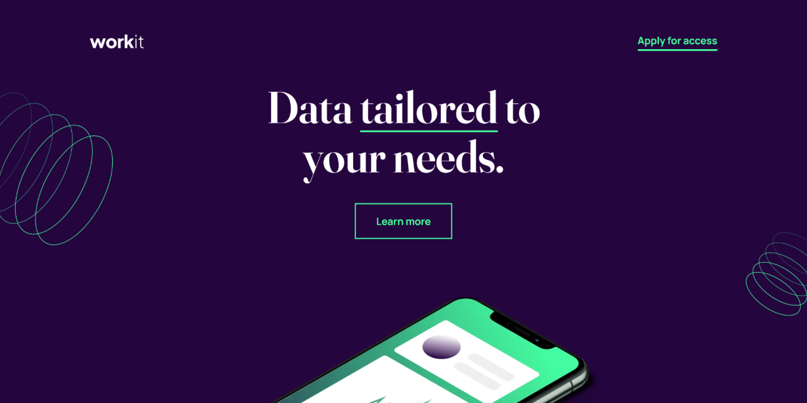

# 🚀 Workit landing page

Responsive landing page built as a Frontend Mentor challenge, focused on clean structure, scalable CSS and accessible interactions.

This is a solution to the [Workit landing page challenge on Frontend Mentor](https://www.frontendmentor.io/challenges/workit-landing-page-2fYnyle5lu).

---

## 🔗 Links

- 🌎 [Live site](https://vimpdev.github.io/fem-16-workit-landing-page/)
<!-- - 📌 [Frontend Mentor solution]() -->

---

## 🎬 Demo

---

## 📸 Screenshots

| 📱 Mobile | 📲 Tablet |
| --- | --- |
|  |  |

| 🖥️ Desktop | 🖱️ Interaction |
| --- | --- |
|  |  |

---

## 🧠 Overview

This project focuses on building a fully responsive landing page using modern CSS techniques.
Special attention was given to layout structure, spacing consistency and interactive states.

---

## ⚙️ Built with

- Semantic HTML5
- CSS custom properties (design tokens)
- Flexbox & CSS Grid
- CSS cascade layers (`@layer`)
- Mobile-first workflow

---

## 🎯 Key Features

- Responsive layout across mobile, tablet and desktop
- Interactive states (hover, focus-visible)
- Reusable layout utilities (stack, container)
- Scalable CSS architecture using layers and tokens

---

## 🧩 What I learned during this project

- Structuring CSS using `@layer` to control cascade and organization
- Combining Grid and Flexbox effectively depending on layout needs
- Using `translate` instead of `top`/`left` for positioning
- Improving accessibility with `focus-visible`
- Managing spacing and consistency with custom properties

---

## 💭 Thoughts

This project helped me reinforce layout fundamentals and write more maintainable CSS.  
I focused on keeping the code organized and scalable rather than just making it work.

---

## 🤖 AI Collaboration

I used AI tools as a support resource during development.

- Helped me debug layout issues (especially with Grid)
- Suggested improvements in CSS structure and best practices
- Assisted in refining commit messages and project documentation

I used it mainly to understand concepts better and validate my approach.

---

## 👩‍💻 Author

- Frontend Mentor – [@vimpdev](https://www.frontendmentor.io/profile/vimpdev)

---

## 🏁 Acknowledgments

Thanks to Frontend Mentor for providing practical challenges that help improve real-world frontend skills.